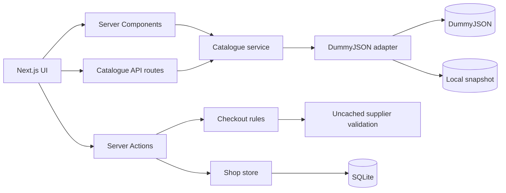

# MiniStore

MiniStore is a full-stack ecommerce demonstration built to show how I approach
production-style frontend architecture, server-side business rules, data
normalization, persistence, accessibility, and automated testing.

The storefront uses DummyJSON as its supplier feed, but the application owns a
stable product contract and all transactional state. Browsing can fall back to a
local product snapshot, while checkout always validates current supplier data,
server-calculated prices, and shared inventory before creating an order.

> This is a portfolio project. Payments, fulfilment, emails, and customer
> accounts are simulated; no money is charged and no goods are shipped.

## What the application demonstrates

- A responsive storefront with a sticky header, fixed hero treatment, category
  discovery, product recommendations, favourites, and a persistent basket.
- Server-driven catalogue search with debounced suggestions, category facets,
  sorting, pagination, bookmarkable URLs, and cancellation of stale requests.
- A provider adapter that validates and normalizes DummyJSON payloads before
  they reach the UI.
- Rich product pages with image galleries, ratings and reviews, availability,
  delivery, returns, warranty, dimensions, and product identifiers.
- Tag- and brand-aware catalogue search, with related products ranked by shared
  tags, category, brand, availability, and rating.
- Server-authoritative basket pricing, delivery calculations, product variants,
  inventory checks, and quantity limits.
- Transactional stock reservations with expiry, protection against overselling,
  and exactly-once stock release or commitment during order transitions.
- A simulated checkout with validated UK delivery details, approved, declined,
  and pending payment outcomes, immutable order snapshots, and idempotent retry
  handling.
- Session-scoped order history and cancellation controls.
- A protected admin workspace for order lifecycle management and editable stock
  scenarios, including sold-out and low-stock demonstrations.
- A reusable design system based on semantic CSS theme variables and shared
  React primitives for buttons, fields, cards, status messages, loading states,
  and layouts.
- Automated domain, persistence, API, security, and component tests.

## Technology

| Area | Implementation |
| --- | --- |
| Framework | Next.js 16 App Router and React 19 |
| Language | TypeScript, with a small amount of legacy JavaScript |
| Styling | Tailwind CSS 4 and semantic CSS custom properties |
| Persistence | Node SQLite through `node:sqlite` |
| Product feed | Normalized DummyJSON with a local fallback |
| Mutations | Next.js Server Actions |
| Component tests | Jest, JSDOM, and React Testing Library |
| Domain tests | Node's built-in test runner |
| Deployment | Vercel through GitHub Actions |

## Customer experience

The homepage introduces the store through a responsive hero, category cards,
and a horizontally scrollable Top Sellers collection. All product cards share
the same hover and keyboard-focus treatment and expose direct basket and
favourite actions.

The catalogue is rendered from normalized server data. Search terms, category,
sort order, favourites-only mode, and page number are stored in the URL. This
makes result pages shareable and keeps filtering compatible with browser
navigation. The header suggestion endpoint returns up to four lightweight
matches after a 300 ms debounce; short searches do not issue a request.

Product pages display the normalized product record and related products.
Clothing categories expose MiniStore-owned S, M, L, and XL variants; other
products use a Standard variant. Each variant is stored as an independent basket
line.

Basket data, favourites, and delivery preference persist in SQLite behind an
opaque 30-day HTTP-only session cookie. The server recalculates every quote from
the current catalogue. Monetary values are stored as integer pence, with GBP as
the display currency. Standard delivery is £3.50 and becomes free at £100;
premium is £4.50 and next-day is £5.00.

Continuing from the basket reserves shared stock for 15 minutes and opens the
checkout directly. The final submission
revalidates the session, basket fingerprint, current price, inventory, delivery
details, and simulated payment outcome. A unique checkout identifier makes
retries idempotent. Orders are visible only to the session that created them.

## Admin demonstration

`/admin` redirects to `/admin/orders`. After signing in, a reviewer can:

- inspect the 200 most recent demo orders;
- move orders through valid lifecycle transitions;
- review status history;
- edit shared on-hand inventory;
- create sold-out and low-stock scenarios; and
- observe how active reservations constrain stock changes.

Order transitions are explicit:

```text
pending → paid → processing → shipped
    └──────────────→ cancelled
```

The admin password is configured through `MINISTORE_ADMIN_PASSWORD`. For the
portfolio demo it can intentionally be set to `password`. Login attempts are
rate-limited in memory, password comparison uses constant-time comparison, and
the signed admin cookie is HTTP-only, SameSite Strict, secure in production, and
expires after eight hours.

## Architecture



The main boundaries are:

- `lib/products.ts` validates unknown provider payloads and maps them to the
  application-owned `Product` type.
- `lib/api.ts` provides the cached browsing feed, a 10-second timeout, and local
  fallback behaviour.
- `lib/catalogue-query.ts` owns filtering, facets, relevance, sorting, and safe
  pagination.
- `lib/basket.ts` owns variants, quantities, integer-money quotes, and delivery
  rules.
- `lib/checkout.ts` owns customer validation, quote fingerprints, and checkout
  draft creation.
- `lib/shop-store.ts` owns SQLite transactions, sessions, reservations,
  inventory, orders, and lifecycle consistency.
- `app/actions` contains the mutation boundary for basket, checkout, admin, and
  order operations.
- `components/ui` contains the design-system primitives. Theme values are
  defined in `app/globals.css` and exposed as semantic Tailwind utilities.
- Loading feedback uses the shared spinner throughout: buttons keep their
  original dimensions while submitting, inline activity reserves its space,
  and route transitions use a consistent labelled loading state.

### Project structure

```text
app/
  actions/                 Server-side mutations
  admin/orders/            Admin authentication, orders, and inventory
  api/products/            Catalogue and suggestion endpoints
  basket/ checkout/        Purchase journey
  favourites/ orders/      Session-scoped customer features
  products/                Catalogue and product detail routes
components/
  ui/                      Design-system primitives
  ProductCard.tsx          Shared catalogue card
  ProductScroller.tsx      Reusable horizontal collection
hooks/                     Debouncing and URL filter behaviour
lib/                       Domain services and persistence
data/products.json         Offline browsing snapshot
tests/                     Node server and domain tests
__tests__/components/      Jest and Testing Library tests
```

## Routes and APIs

| Route | Purpose |
| --- | --- |
| `/` | Homepage, categories, and Top Sellers |
| `/products` | Searchable and filterable catalogue |
| `/products/[id]` | Product details, variants, and recommendations |
| `/favourites` | Products saved by the current session |
| `/basket` | Basket editing, delivery selection, and totals |
| `/checkout` | Validated delivery form, order summary, and simulated payment submission |
| `/orders` | Current session's order history |
| `/orders/[id]` | Order details and valid customer controls |
| `/admin/orders` | Protected order and inventory management |

`GET /api/products` accepts `q` or `search`, `category`, `sort`, `page`,
`pageSize`, and `favs=true`. It returns normalized items, total counts, safe page
metadata, and category facets. Responses are private and not shared by caches.

`GET /api/products/suggestions?q=...` returns at most four normalized summaries.
Queries shorter than two characters return an empty result. Successful responses
may be cached publicly for 60 seconds.

## Local development

Requirements:

- Node.js 24 or newer
- npm

Clone the repository and install dependencies:

```bash
git clone https://github.com/MartynRoberts/ministore.git
cd ministore
npm ci
```

Create `.env.local`:

```dotenv
MINISTORE_ADMIN_PASSWORD=password
# Optional; defaults to .data/ministore.sqlite
MINISTORE_DB_PATH=.data/ministore.sqlite
# Optional locally; set to the public origin for canonical and sitemap URLs
NEXT_PUBLIC_SITE_URL=https://example.com
# Umami website ID; analytics remains disabled when omitted
NEXT_PUBLIC_UMAMI_WEBSITE_ID=00000000-0000-0000-0000-000000000000
# Optional for self-hosted Umami; defaults to Umami Cloud
NEXT_PUBLIC_UMAMI_SCRIPT_URL=https://cloud.umami.is/script.js
```

Start the development server:

```bash
npm run dev
```

Open [http://localhost:3000](http://localhost:3000). SQLite tables and the local
database file are created lazily on the first state-changing request.

## Testing and quality checks

MiniStore has two complementary test layers:

- **39 Node tests** cover API normalization and failure handling, catalogue
  queries, server actions, basket rules, SQLite persistence, checkout security,
  competing stock reservations, order transitions, and admin authorization.
- **22 Jest and React Testing Library tests** cover shared UI primitives,
  accessible form behaviour, pagination, product-card interactions, and the
  admin password experience.

Run the complete 61-test suite and generate frontend coverage:

```bash
npm run test:ci
```

Additional commands:

| Command | Purpose |
| --- | --- |
| `npm test` | Run component tests once |
| `npm run test:watch` | Run relevant component tests while developing |
| `npm run test:coverage` | Generate terminal and HTML Jest coverage |
| `npm run test:server` | Run the domain and server suite |
| `npm run lint` | Run ESLint |
| `npx tsc --noEmit` | Type-check source and tests |
| `npm run build` | Create and validate the production build |

Component tests query accessible roles, labels, and visible text and use
`user-event` for interaction. Domain tests exercise authoritative rules and real
SQLite transactions. Jest coverage measures the configured frontend source;
the separate Node suite is not included in the Jest percentage.

## Data, resilience, and security decisions

- Browsing uses a cached DummyJSON feed with one-hour revalidation. Network,
  HTTP, JSON, and schema failures fall back to `data/products.json`.
- Checkout deliberately bypasses that fallback and fetches uncached supplier
  data. An order cannot be approved when current price and stock cannot be
  verified.
- All mutation inputs are validated on the server. Product IDs, variants,
  quantities, delivery methods, checkout ownership, and order transitions are
  treated as untrusted.
- Basket and order cookies contain opaque identifiers or signed tokens rather
  than customer or commerce data.
- SQLite transactions coordinate inventory across connections and roll back
  failed order operations without losing reservations or basket contents.
- Product images remain remote DummyJSON assets and therefore require network
  access even when catalogue text uses the local snapshot.

## Accessibility

Mini Store targets WCAG 2.2 Level AA. The shared design system provides visible
keyboard focus, labelled controls, accessible loading and error announcements,
minimum control sizes, semantic page landmarks, a skip link, responsive reflow,
and reduced-motion behaviour. Mobile navigation moves focus as users enter and
leave menu levels, and Escape closes open navigation and restores trigger focus.

Representative homepage, catalogue, product, basket, favourites, checkout,
orders, and admin routes score 100 in Lighthouse accessibility audits. Automated
results do not establish WCAG conformance on their own; releases should also be
checked with keyboard-only navigation, browser zoom and a representative screen
reader on supported browsers.

## Deployment

Pushes to `main` trigger `.github/workflows/deploy.yml`, which builds and deploys
the project to Vercel. The workflow requires these GitHub repository secrets:

- `VERCEL_TOKEN`
- `VERCEL_ORG_ID`
- `VERCEL_PROJECT_ID`

The production environment must also define `MINISTORE_ADMIN_PASSWORD` and
should define `NEXT_PUBLIC_SITE_URL` as its public origin. Vercel deployment
URLs are detected automatically when the latter is omitted. The
default SQLite store is appropriate for this single-instance demonstration. A
multi-instance or serverless production commerce system would use a shared
managed database, durable job processing, account-based identity, a real payment
provider with verified webhooks, and integrations for fulfilment and customer
communications.

## Scope

MiniStore is intentionally a focused commerce simulator. It demonstrates the
application boundaries and failure handling expected in a larger ecommerce
platform without pretending that a portfolio deployment provides live payment,
warehouse, identity, tax, or fulfilment services.
